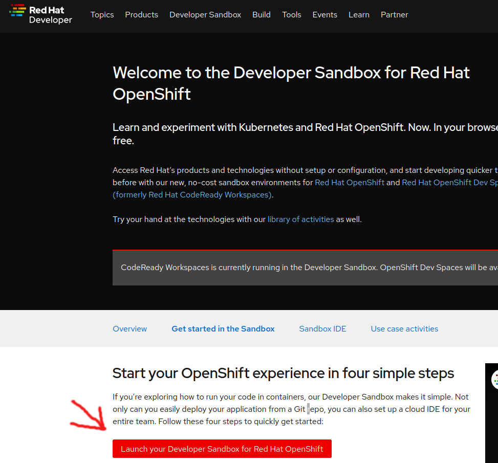
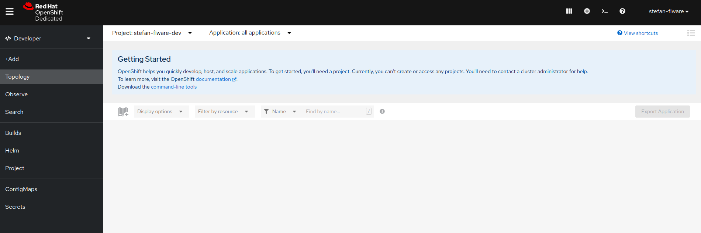
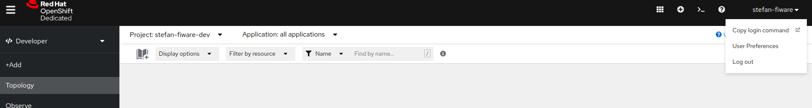
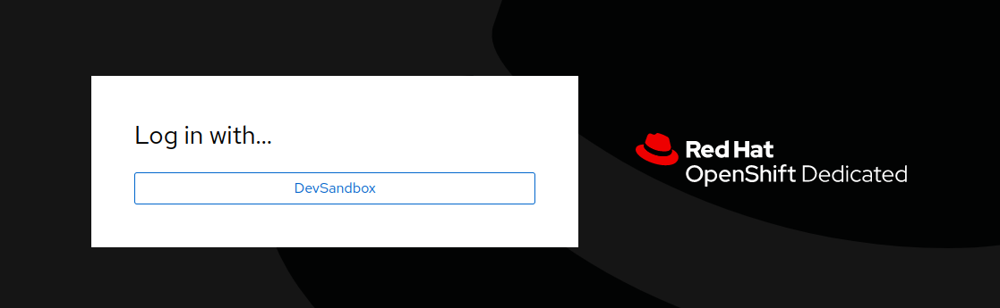
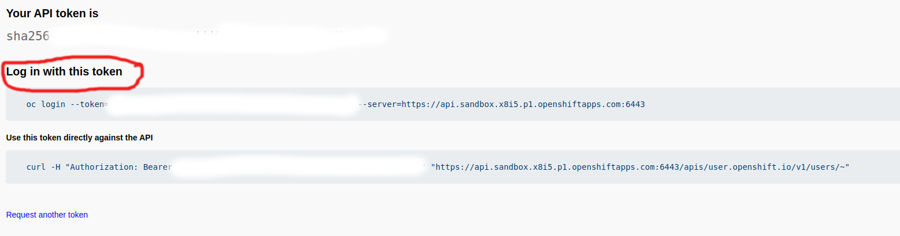

# Deploy minimal example to the OpenShift Sandbox

This is an installation guide, targeting audience without (much) kuberentes expierence and therefore not having an already working cluster available. We use the [RedHat OpenShift Developer Sandbox](https://developers.redhat.com/developer-sandbox) to get a fully working OpenShift to build on, without any costs. The cluster itself has some restrictions and cannot be used for production purposes, but is very suitable as a starting point. If you closely follow the steps described, everything will be up-and-running properly.

>:warning: Do NOT use this as a production environment. It contains plain-text passwords and other anti-patterns(f.e. no resource limits, no availability settings, no backups) that will harm you in production. Its a development setup, that should be treated as such.

## Step-by-step guide

1. Create account and sandbox on the [offical page from RedHat](https://developers.redhat.com/developer-sandbox/get-started)
launch 



2. Follow the guide to the openshift-console:


3. Get the token and login from your console:



---



---



--> login using your local shell

4. Install [helm](https://helm.sh/docs/intro/install/) andl [kubectl](https://kubernetes.io/docs/tasks/tools/) locally via the offical documentation.

5. Clone tutorials repository
```shell
    git clone git@github.com:i4Trust/tutorials.git
```

6. Move to sandbox folder:
```shell
    cd tutorials/OpenShift-Sandbox/
```

7. Install mongoDB:

>:warning: The sandbox allows installations to a dev namepsace. The namespace will have the name ```<YOUR_RED_HAT_ACCOUNT>-dev```

```shell
    helm dependency build ./mongodb/
    helm install mongodb ./mongodb/ -n <YOUR_ACCOUNT>-dev
```

Verify:
```shell
    kubectl get pods -n <YOUR_ACCOUNT>-dev

    NAME                       READY   STATUS    RESTARTS   AGE
    mongodb-7d4b49b5f9-q54tm   1/1     Running   0          61s
```

8. Install mysql:

```shell
    helm dependency build ./mysql/
    helm install mysql ./mysql/ -n <YOUR_ACCOUNT>-dev
```

Verify:
```shell
    kubectl get pods -n <YOUR_ACCOUNT>-dev

    NAME                       READY   STATUS    RESTARTS   AGE
    mongodb-7d4b49b5f9-gr2cj   1/1     Running   0          83s
    mysql-664b9568bf-sh9k2     1/1     Running   0          39s
```

9. Install keyrock:

> :warning: replace cert and key in the [secrets.yaml](./keyrock/templates/secrets.yaml) with your data. They need to be base64 encoded.

```shell
    helm dependency build ./keyrock/
    helm install keyrock ./keyrock/ -n <YOUR_ACCOUNT>-dev
```

Verify:

```shell
    kubectl get pods -n <YOUR_ACCOUNT>-dev

    NAME                       READY   STATUS    RESTARTS   AGE
    keyrock-0                  1/1     Running   0          75s
    mongodb-7d4b49b5f9-gr2cj   1/1     Running   0          12m
    mysql-664b9568bf-sh9k2     1/1     Running   0          11m
```

Get the address:

```shell 
    kubectl get route keyrock -n <YOUR_ACCOUNT>-dev

    NAME      HOST/PORT                                                          PATH   SERVICES   PORT   TERMINATION   WILDCARD
    keyrock   keyrock-stefan-fiware-dev.apps.sandbox.x8i5.p1.openshiftapps.com          keyrock    8080                 None
```

Open in browser http://<URL> and login with ```User: my-admin@mail.org Password: admin```

11. Install Orion-LD:

```shell
    helm dependency build ./orion-ld/
    helm install orion-ld ./orion-ld/ -n <YOUR_ACCOUNT>-dev
```

Verify:

```shell
    kubectl get pods -n <YOUR_ACCOUNT>-dev

    NAME                         READY   STATUS    RESTARTS   AGE
    keyrock-0                    1/1     Running   0          3h3m
    mongodb-64949fb874-8fsh2     1/1     Running   0          3m41s
    mysql-664b9568bf-sh9k2       1/1     Running   0          3h14m
    orion-ld-58ddb4bcfb-rpx4x    1/1     Running   0          32s
```

12. Install Kong:

Insert certificate and key into the [secret-file](./kong/template/secret.yaml). Make sure to base64-encode it.
Update the configuration for the backend service(usually the context broker) to be secured in the [config-map](./kong/template/configmap.yaml). 

> :warning: Do not forget the ```--skip-crds```. The sandbox does not allow cluster-wide CRDs and we dont need them in our use-case.

```shell
    helm dependency build ./kong/
    helm install kong ./kong/ -n <YOUR_ACCOUNT>-dev --skip-crds
```

Verify:

```shell
    kubectl get pods -n <YOUR_ACCOUNT>-dev

    NAME                         READY   STATUS    RESTARTS   AGE
    keyrock-0                    1/1     Running   0          159m
    kong-kong-64fb477547-42d2p   1/1     Running   0          35s
    mongodb-7d4b49b5f9-96npm     1/1     Running   0          145m
    mysql-664b9568bf-sh9k2       1/1     Running   0          170m
```

The system now can be reached at: 

```shell
   kubectl get routes kong-route -n <YOUR_ACCOUNT>-dev -o json | jq -r '.spec.host'
```

## Try out the setup

Put your client key and certificate into the folder to mount(the files in  [example-secrets](./doc/example-secrets/)) are only generated examples) and use the correct IDs.

1. Generate a [JWT](https://dev.ishareworks.org/introduction/jwt.html) for your client:
```shell
    docker run -v $(pwd)/doc/example-secrets:/certificates -e I_SHARE_CLIENT_ID="EU.EORI.NLHAPPYPETS" -e I_SHARE_IDP_ID="EU.EORI.NLPACKETDEL"  quay.io/wi_stefan/ishare-token
```

The token will be print out on the command-line. Be aware that it is(as defined by iShare) only valid for 30s.

2. Request a token: 
```shell 
    curl --location --request POST 'https://ar.isharetest.net/connect/token' \
        --header 'Content-Type: application/x-www-form-urlencoded' \
        --data-urlencode 'grant_type=client_credentials' \
        --data-urlencode 'scope=iSHARE' \
        --data-urlencode 'client_assertion_type=urn:ietf:params:oauth:client-assertion-type:jwt-bearer' \
        --data-urlencode 'client_assertion=<GENERATED_TOKEN>' \
        --data-urlencode 'client_id=EU.EORI.NLHAPPYPETS'
```

The response will look  like:

```json
{
    "access_token": "<TOKEN>",
    "expires_in": 3600,
    "token_type": "Bearer"
}
    ```

3. Request at kong:

```shell
curl --location --request GET '<KONG-ADDRESS>/orion/ngsi-ld/v1/entities/urn:ngsi-ld:TEST:ENTITY' \
--header 'Authorization: Bearer <ACCESS_TOKEN' 
```
    
This should lead to the response:
    
```json
  {
      "message": "Local AR policy not authorized: Policy has expired or is not yet valid"
  }
```
No policies are configured yet, but Kong accepted the requests and checked the token. Create policies as you need now.
