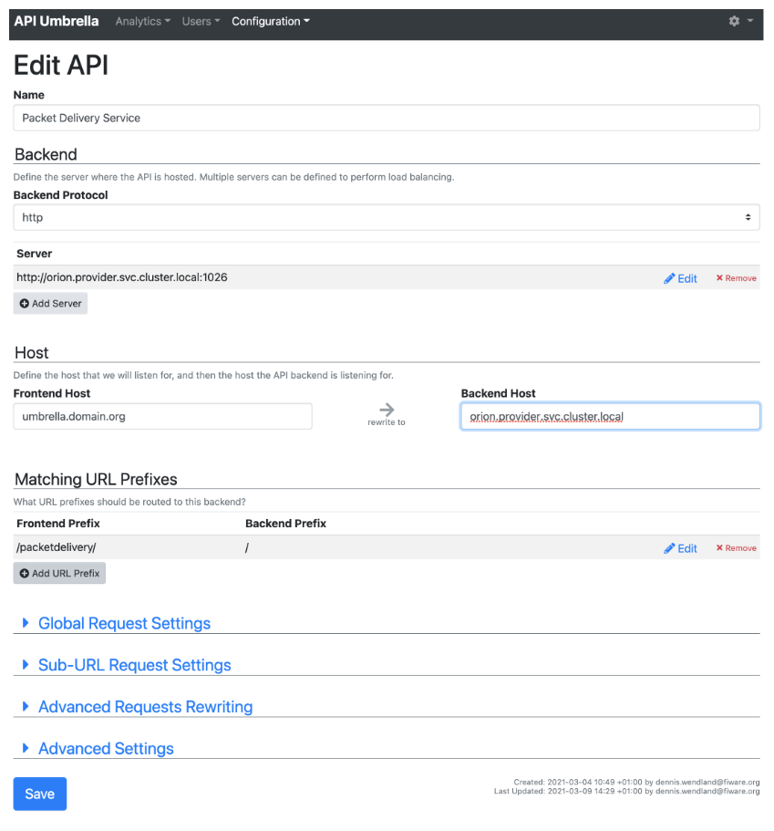
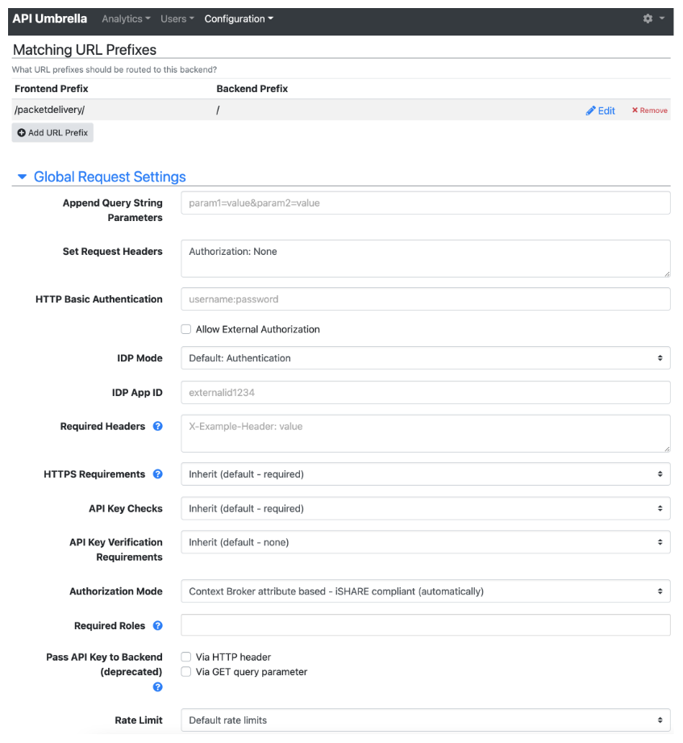

# Data Service Provider

This describes how to setup an NGSI-LD based data service provider within the i4Trust trusted data space with the 
example of a fictitious Packet Delivery Company, which will provide digital packet delivery services.

The actual NGSI-LD data service is provided by an instance of the Orion-LD Context Broker. The following instructions 
describe how to deploy all required components on Kubernetes using Helm charts.

The whole environment will consist of the following components:
* [MongoDB](#mongodb)
* [MySQL](#mysql)
* [Orion Context Broker](#context-broker-orion)
* [Keyrock (Identity Provider)](#keyrock)
  - [Keyrock AR functionality](#keyrock-authorization-registry-functionality)
* [PEP Proxy/PDP](#pep-proxy--pdp)
  - [Kong](#kong)
  - [Deprecated: API-Umbrella + elasticsearch](#deprecated-api-umbrella)
* [Activation Service](#activation-service)
* [Portal demo application](#packet-delivery-portal-demo-application)

as depicted in the following diagram:


Furthermore it is required that there is access to an iSHARE Satellite instance and an iSHARE-compliant Authorisation 
Registry. It is assumed that the data service provider is already registered at the iSHARE Satellite and that 
certificates, a private key and the EORI have been issued. For the Authorization Registry, Keyrock has an 
iSHARE-compliant Authorisation Registry implementation which can be used instead.

In the following it is assumed that the components will be externally available via the domain `domain.org` and that the 
issued EORI is `EU.EORI.NLPACKETDEL`. 

This description provides examples of the [Helm values files](./values) which show the minimum configuration 
parameters to be set. Adapt these for your setup before proceeding with the instructions.

The helm charts of the FIWARE Generic enablers with all possible configuration values can be found here:
* [orion](https://github.com/FIWARE/helm-charts/tree/main/charts/orion)
* [API Umbrella](https://github.com/FIWARE/helm-charts/tree/main/charts/api-umbrella)
* [Keyrock](https://github.com/FIWARE/helm-charts/tree/main/charts/keyrock)

Helm charts of the i4Trust related components with all possible configuration values can be found here:
* [Activation Service](https://github.com/i4Trust/helm-charts/tree/main/charts/activation-service)
* [Packet Delivery Portal - Demo Application](https://github.com/i4Trust/helm-charts/tree/main/charts/pdc-portal)

The Kong helm chart with all possible configuration values can be found here:
* [Kong](https://github.com/Kong/charts)

Is is assumed that all components will be deployed within the namespace `provider`. Change this name according to your 
needs.
```shell
kubectl create ns provider
```

Due to the iSHARE specification, requests can contain very large headers with the signed JWTs. 
When using Kubernetes, note that the ingress controller must be capable of handling large request headers. When using 
nginx as ingress controller, these are the proposed parameters to be set:
```yaml
large-client-header-buffers: "8 32k"
http2-max-field-size: "32k"
http2-max-header-size: "32k"
```

## MongoDB

First modify the [Helm values file](./values/values-mongodb.yml) according to your environment and 
then deploy `mongodb`:
```shell
helm repo add bitnami https://charts.bitnami.com/bitnami
helm repo update
helm install -f ./values/values-mongodb.yml --namespace provider mongodb bitnami/mongodb --version 12.1.31
```


## MySQL

First modify the [values file](./values/values-mysql.yml) according to your needs and then deploy the MySQL database using `helm`. 
```shell
helm repo add t3n https://storage.googleapis.com/t3n-helm-charts
helm repo update
helm install -f ./values/values-mysql.yml --namespace provider mysql t3n/mysql --version 1.0.0
```


## Context Broker orion

First modify the [Helm values file](./values/values-orion.yml) according to your environment and 
then deploy `orion`:
```shell
helm repo add fiware https://fiware.github.io/helm-charts/
helm repo update
helm install -f ./values/values-orion.yml --namespace provider orion fiware/orion
```


### Creating entites for delivery orders

In order to follow the example of the Packet Delivery Company, there must be pre-existing delivery orders at the 
Packet Delivery Company. This means, that entities of type `DELIVERYORDER` need to be created at the Context Broker 
before. Below is an example of the body for the request when creating such an entity at Orion:
```json
{
    "id": "urn:ngsi-ld:DELIVERYORDER:HAPPYPETS001",
    "type": "DELIVERYORDER",
    "issuer": {
        "type": "Property",
        "value": "Happy Pets"
    },
    "destinee": {
        "type": "Property",
        "value": "Happy Pets customer"
    },
    "deliveryAddress": {
        "type": "Property",
        "value": {
            "addressCountry": "DE",
            "addressRegion": "Berlin",
            "addressLocality": "Berlin",
            "postalCode": "12345",
            "streetAddress": "Customer Strasse 23"
        }
    },
    "originAddress": {
        "type": "Property",
        "value": {
            "addressCountry": "DE",
            "addressRegion": "Berlin",
            "addressLocality": "Berlin",
            "postalCode": "12345",
            "streetAddress": "HappyPets Strasse 15"
        }
    },
    "pda": {
        "type": "Property",
        "value": "2021-10-03"
    },
    "pta": {
        "type": "Property",
        "value": "14:00:00"
    },
    "eda": {
        "type": "Property",
        "value": "2021-10-02"
    },
    "eta": {
        "type": "Property",
        "value": "14:00:00"
    },
    "@context": [
        "https://schema.lab.fiware.org/ld/context",
        "https://uri.etsi.org/ngsi-ld/v1/ngsi-ld-core-context.jsonld"
    ]
}
```
Feel free to create several entities with different properties and entity IDs. Later on these will be accessible 
by the user via the portal application.


## Keyrock

The Keyrock Identity Provider is required for storing the user accounts of the employees of the data service provider's 
company. In the experimentation framework example, it is needed in order that employees can login at the i4Trust 
Marketplace and create offerings on behalf of their company.

Modify the Keyrock [values file](./values/values-keyrock.yml) according to your needs and deploy the Keyrock Identity Provider. 
When there is no external authorisation registry configured for Keyrock, the internal authorisation registry can be used and 
policies need to be stored there.
Make sure to setup an Ingress or OpenShift route in the values file for external 
access of the UI (e.g. https://keyrock.domain.org). The issued private key and certificate 
chain must be added in PEM format. 
```shell
helm repo add fiware https://fiware.github.io/helm-charts/
helm repo update

helm install -f ./values/values-keyrock.yml --namespace provider keyrock fiware/keyrock --version 0.5.1

```

In a browser open the Keyrock UI (e.g. https://keyrock.domain.org) and login with the admin credentials provided in 
the values file. Then users can be created by the Admin user, or users sign up on their own.

When using the internal authorisation registry of Keyrock, one might need to increase the maximum header size of the 
internal web server by setting the ENV, e.g. to
```shell
IDM_SERVER_MAX_HEADER_SIZE=32786
```
See the [values file](./values/values-keyrock.yml) for an example.


### Keyrock Authorization Registry functionality

Keyrock also allows to serve as Authorization Registry (AR) in order to store access policies in its own database. 
Keyrock then implements the [iSHARE /delegation endpoint](https://dev.ishareworks.org/delegation/endpoint.html) 
which allow to query for delegation evidences. 

In order to activate the AR functionality, the following parameter needs to be set in 
the [values file](./values/values-keyrock.yml):
```yaml
authorisationRegistry:
  url: "internal"
```
In this case, the parameters for `tokenEndpoint` and `delegationEndpoint` are ignored. 
The parameter for the AR `identifier` needs to be changed to the EORI of the organisation 
that operates this Keyrock/AR instance.

When activated, Keyrock provides the following endpoints:
* `/ar/delegation`: Query/obtain delegation evidences
* `/ar/policy`: Create delegation evidences

Access tokens for the AR need to be retrieved from the `/oauth2/token` endpoint, as described 
in the [iSHARE Access Token specification](https://dev.ishareworks.org/common/token.html).


## PEP Proxy / PDP

It is recommended to use Kong as PEP and PDP.

### Kong

Kong is an API Gateway. With the usage of the 
[ngsi-ishare-policies](https://github.com/FIWARE/kong-plugins-fiware/tree/main/kong-plugin-ngsi-ishare-policies) 
plugin, it can be used as Policy Enforcement Point (PEP) and Policy Decision Point (PDP).

Modify the [Kong values file](./values/values-kong.yml) and 
[Kong declarative setup configuration file](./kong/kong.yml). Then perform the deployment using 
Helm.  
Depending on whether you use an external or the Keyrock built-in authorisation registry, it's endpoints and configuration 
parameters need to be configured accordingly.
Make sure to setup an Ingress or OpenShift route in the values file for external 
access to the provided Kong endpoints/routes. The issued private key and certificate 
chain must be added in PEM format. 

```shell
helm repo add kong https://charts.konghq.com
helm repo update
helm install -f ./values/values-kong.yml --namespace provider kong kong/kong --set ingressController.installCRDs=false --set-file dblessConfig.config=./kong/kong.yml --version 2.8.0
```

Kong is now configured to receive requests at the `/packetdelivery` endpoint, check the access rights from the 
policies at the authorisation registries and, if access is granted, to forward the requests to the Orion Context Broker.


### Deprecated: API-Umbrella

API-Umbrella can be used as Policy Enforcement Point (PEP) and Policy Decision Point (PDP) as well.

It requires an instance of elasticsearch:  
First modify the [Helm values file](./values/values-elastic.yml) according to your environment and 
then deploy `elasticsearch`:
```shell
helm repo add elastic https://helm.elastic.co
helm repo update
helm install -f ./values/values-elastic.yml --namespace provider elasticsearch elastic/elasticsearch --version 7.5.1
```

During deployment of the MongoDB using the provided values file, a database should have been created for API Umbrella. 
In case this was removed from the values file, it is needed to create the necessary database and user within the MongoDB 
manually. This requires to enter a shell within the MongoDB pod, 
starting the MongoDB client and perform the commands below for creating the user.
```shell
# Enter pod
kubectl exec -n provider --stdin --tty mongodb-xyz -- /bin/bash

# Start mongo client
mongo -u root     # (provide MongoDB root PW)

# Within mongo client:
> use api_umbrella
> db.createUser({user: "api_umbrella", pwd: "api-umbrella-password", roles: [{role: "readWrite", db: "api_umbrella"}]})
```

Now modify the [API Umbrella values file](./values/values-umbrella.yml) according to your setup and perform 
the deployment using Helm.  
Note, for the verification of signed JWTs according to iSHARE specifications, you need to configure the iSHARE Satellite 
endpoint.  
Check that in the database configuration, you provide the same password for the database user as has been used when creating 
the MongoDB database and user.  
Depending on whether you use an external or the Keyrock built-in authorisation registry, it's endpoints and configuration 
parameters need to be configured accordingly.
Make sure to setup an Ingress or OpenShift route in the values file for external 
access of the UI (e.g. https://umbrella.domain.org). The issued private key and certificate 
chain must be added in PEM format. 
```shell
helm repo add fiware https://fiware.github.io/helm-charts/
helm repo update
helm install -f ./values/values-umbrella.yml --namespace provider api-umbrella fiware/api-umbrella --version 0.0.10
```

When first opening the page (https://umbrella.domain.org/admin), the credentials of the admin user can be set.

Within the Admin UI, create a new API Backend for the Orion Context Broker and configure it for the 
`Context Broker attribute based - iSHARE compliant` Authorization Mode, as depicted in the following pictures:





API-Umbrella is now configured to receive requests at the `/packetdelivery` endpoint, check the access rights from the 
policies at the authorisation registries and, if access is granted, to forward the requests to the Orion Context Broker.


## Activation Service

The [Activation Service](https://github.com/i4Trust/activation-service) is required to proxy requests from the 
i4Trust Marketplace for creating policies when companies 
acquired access to the data service. For this it provides endpoints `/token` and `/createpolicy` according to the iSHARE
scheme.

Modify the Activation Service [values file](./values/values-activation-service.yml) according to your needs and deploy 
the Activation Service. Especially configure the Authorisation Registry used (e.g., either an external AR or the internal 
one of Keyrock).
Make sure to setup an Ingress in the values file for external 
access (e.g. https://activation-service.domain.org). The issued private key and certificate 
chain must be added in PEM format.
```shell
helm repo add i4trust https://i4trust.github.io/helm-charts
helm repo update
helm install -f ./values/values-activation-service.yml --namespace provider activation-service i4trust/activation-service --version 1.3.2
```

In order to allow external parties to create policies on behalf of the Packet Delivery Company, a policy needs to be created 
for these external organisations. This would be the case, when the data service would be offered on a marketplace.
As an example, considering a marketplace with EORI `EU.EORI.NLMARKETPLA` should be allowed 
to create policies when organisations acquire access to the service offering, the policy to be created would look 
like this:
```json
{
	"delegationEvidence": {
		"notBefore": 1614354348,
		"notOnOrAfter": 1654083306,
		"policyIssuer": "EU.EORI.NLPACKETDEL",
		"target": {
			"accessSubject": "EU.EORI.NLMARKETPLA"
		},
		"policySets": [
			{
				"policies": [
					{
						"target": {
							"resource": {
								"type": "delegationEvidence",
								"identifiers": [
									"*"
								],
								"attributes": [
									"*"
								]
							},
							"actions": [
								"POST"
							]
						},
						"rules": [
							{
								"effect": "Permit"
							}
						]
					}
				]
			}
		]
	}
}
```
Make sure to adapt the expiration timestamp accordingly.


## Packet Delivery Portal Demo Application

This is a demo application of a [Packet Delivery Portal](https://github.com/i4Trust/pdc-portal) allowing 
external users to view and change their 
delivery orders stored at the Orion Context Broker. For accessing the service via the PEP/PDP, the users and 
connected retailer companies need the required policies at the authorisation registries.

This demo is intended to showcase how to setup an application that accesses the provided data service via a 
PEP/PDP following the iSHARE specification. Note that this application is dedicated only to this reference example 
of the Packet Delivery. However, it gives an example on how to implement the different flows in other portal 
applications.

Modify the PDC Portal [values file](./values/values-pdc-portal.yml) according to your needs. 

In the portal application, external login options need to be added, targeting at the different 
IDPs (Keyrock) of consuming organisations (e.g., Happy Pets and No Cheaper) that need to have access to the service 
offering. In the values file, 
adapt the IDP endpoints according to your setup. Also check the instructions about a 
[Data Service Consumer](../Data-Service-Consumer). 

Make sure to setup an Ingress or OpenShift Route in the values file for external 
access (e.g. https://pdc-portal.domain.org). The issued private key and certificate 
chain must be added in PEM format.

The portal application can then be deployed using:
```shell
helm repo add i4trust https://i4trust.github.io/helm-charts
helm repo update
helm install -f ./values/values-pdc-portal.yml --namespace provider pdc-portal i4trust/pdc-portal --version 2.1.0
```


### Granting access for a consuming party

In order that users of an external organisation can access certain entities via the portal application, 
a policy at the provider's authorisation registry needs to be created first, which grants access to the organisation 
and allows the organisation to delegate the access to it's users. This builds a delegation chain so that the 
service provider does only need to know it has granted access to the specific organisation, but does not 
need to know anything about the user which finally accesses the service.

As an example, for an organisation Happy Pets with EORI `EU.EORI.NLHAPPYPETS` being granted read access (the portal performs GET requests 
when accessing a certain entity) to all entities of type 
`DELIVERYORDER` for all attributes, and write access (the portal performs PATCH requests when updating certain 
attributes) for the attributes of `pta` and `pta`, such policy would look like the following:
```json
{
	"delegationEvidence": {
		"notBefore": 1624634606,
		"notOnOrAfter": 1624636406,
		"policyIssuer": "EU.EORI.NLPACKETDEL",
		"target": {
			"accessSubject": "EU.EORI.NLHAPPYPETS"
		},
		"policySets": [
			{
				"maxDelegationDepth": 0,
				"target": {
					"environment": {
						"licenses": [
							"ISHARE.0001"
						]
					}
				},
				"policies": [
					{
						"target": {
							"resource": {
								"type": "DELIVERYORDER",
								"identifiers": [
									"*"
								],
								"attributes": [
									"pta",
									"pda"
								]
							},
							"actions": [
								"PATCH"
							]
						},
						"rules": [
							{
								"effect": "Permit"
							}
						]
					},
					{
						"target": {
							"resource": {
								"type": "DELIVERYORDER",
								"identifiers": [
									"*"
								],
								"attributes": [
									"*"
								]
							},
							"actions": [
								"GET"
							]
						},
						"rules": [
							{
								"effect": "Permit"
							}
						]
					}
				]
			}
		]
	}
}
```
Note that such policy would be created by the marketplace plugin, in the case that the offering is acquired 
on the marketplace by a certain organisation like Happy Pets.


### Granting access to a certain user

In the environment of the consuming organisation, more precisely that means the organisation that was granted access to 
the service as described in the previous section, access policies need to be delegated to it's users that 
should be allowed to access the service of the provider.

For this, check the instructions about the [Data Service Consumer](../Data-Service-Consumer).

When logging in at the portal application via the consuming organisation's (e.g. Happy Pets) Keyrock IDP, 
the user receives an iSHARE-compliant JWT which will be sent along all requests to the provider's packet delivery service 
endpoint, namely the PEP/PDP instance performing the access management for the service provider's 
context broker.

Depending on whether the consuming organisation's Keyrock instance was configured using it's own authorisation registry 
or an external one, the JWT will contain either directly the user's policies or just access information about the external 
authorisation registry, which will allow the PDP to check for the necessary access rights of the user.
