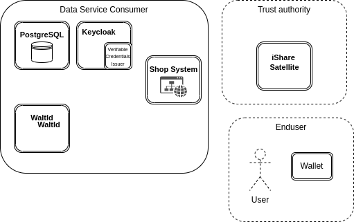
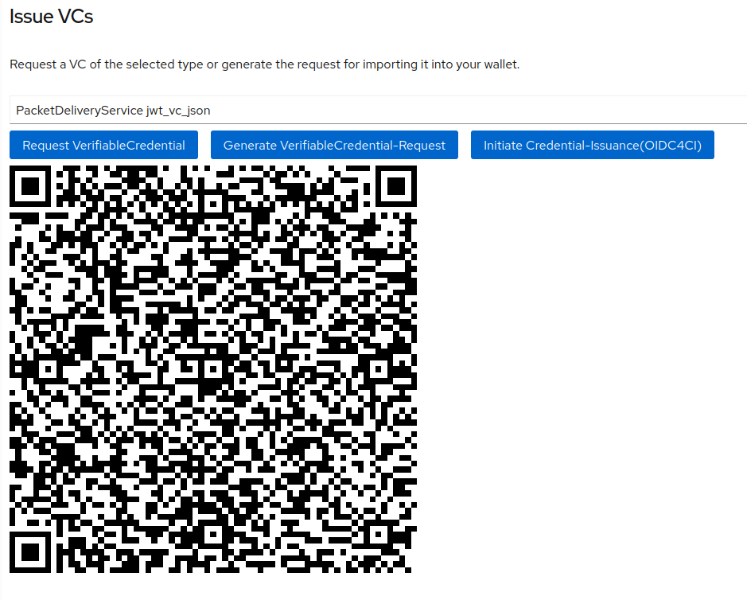

# Data Service Consumer with verifiable credentials

This describes how to setup the environment of a data service consuming organisation within the i4Trust trusted data space with the example of the fictitious organisations

* Packet Delivery Company being the service provider
* Happy Pets Inc. being the consuming organisation

Needed for issuing credentials that can be used against the authentication of the service provider's environment are the following
* [WaltId](https://github.com/walt-id/waltid-ssikit)
* [Keycloak](https://www.keycloak.org/) with the [VC Issuer plugin](https://github.com/wistefan/keycloak-vc-issuer)

Furthermore are needed
* VC compatible Wallet for executing the OpenIDConnect flow
* iSHARE Satellite as trust anchor for sharing trusted parties



Note that no Shop System is provided as part of the example. In this use case example, it is assumed that there are already 
users registered at Happy Pets and which have placed orders. More precisely, this means that there are already 
existing delivery order entities within the Context Broker of 
the [Data Service Provider](../Data-Service-Provider).

Furthermore it is required that there is access to an iSHARE Satellite instance and an iSHARE-compliant Authorisation 
Registry which stores the user's access policies.

In the following it is assumed that the components will be externally available via the domain `domain.org`. 

## Installation

It is recommended to at least change the "route.host" property of the keycloak chart to adjust to the own test environment.

To install the components execute the following commands

```
helm dependency build waltid/
helm install -ndemo waltid ./waltid/ -f ./waltid/values.yaml
helm dependency build keycloak/
helm install -ndemo keycloak ./keycloak/ -f ./keycloak/values.yaml
```

## Overview of the users/credentials

With the predefined value files, users and DIDs for the necessary parties are imported as follows:

|   |   |
|---|---|
|DID of consumer's authentication authority | did:key:z6MkigCEnopwujz8Ten2dzq91nvMjqbKQYcifuZhqBsEkH7g |
|DID of provider's authentication authority | did:key:z6MkigCEnopwujz8Ten2dzq91nvMjqbKQYcifuZhqBsEkH7h |
|Password for 'normal-user'   | normal-user  |
|Password for 'premium-user'   | premium-user  |

## Validation of components
### WaltId

WaltId is the component that is used for creating Verifiable Credentials that match a given template using a defined key. The template is provided on startup and the key is registered by the Keycloak VC Issuer Plugin.

To validate that the template was successfully imported, following command can be used in the k8s cluster:

```
curl -X 'GET' 'http://waltid-vcwaltid:7001/v1/templates/PacketDeliveryService' -H 'accept: application/json'
```
with an expected output of
```
{
    "type": [
        "VerifiableCredential",
        "PacketDeliveryService"
    ],
    "@context": [
        "https://www.w3.org/2018/credentials/v1"
    ],
    "id": "urn:uuid:3add94f4-28ec-42a1-8704-4e4aa51006b4",
    "issuer": "did:ebsi:2A9BZ9SUe6BatacSpvs1V5CdjHvLpQ7bEsi2Jb6LdHKnQxaN",
    "issuanceDate": "2021-08-31T00:00:00Z",
    "issued": "2021-08-31T00:00:00Z",
    "validFrom": "2021-08-31T00:00:00Z",
    "credentialSchema": {
        "id": "https://raw.githubusercontent.com/hesusruiz/dsbamvf/main/schemas/PacketDeliveryService/2022-10/schema.json",
        "type": "FullJsonSchemaValidator2021"
    },
    "credentialSubject": {
        "id": "did:ebsi:2AEMAqXWKYMu1JHPAgGcga4dxu7ThgfgN95VyJBJGZbSJUtp",
        "familyName": "User",
        "firstName": "Some",
        "roles": [
            {
                "names": [
                    "someRole"
                ],
                "target": "did:some:id"
            }
        ]
    }
}
```

To validate that the signing key was successfully registered by the Keycloak VC Issuer Plugin, the following command can be used

```
curl -X 'GET' 'http://waltid-vcwaltid:7002/keys/z6MkigCEnopwujz8Ten2dzq91nvMjqbKQYcifuZhqBsEkH7g'   -H 'accept: application/json'
```
with an expected output of
```
{
    "algorithm": "EdDSA_Ed25519",
    "cryptoProvider": "SUN",
    "keyId": {
        "id": "z6MkigCEnopwujz8Ten2dzq91nvMjqbKQYcifuZhqBsEkH7g"
    },
    "keyPair": {},
    "keysetHandle": null
}
```

### Keycloak

Keycloak IDM is used for managing the users in the consumer space and offering verifiable credentials for accessing the data provider.

A GUI for providing Verifiable Credentials to be imported into the wallet can be found under

https://kc-consumer.domain.org/realms/fiware-server/account/#/verifiable-credentials

and are provided via QR code like


Alternatively its possible to request the signed Verifiable Credentials via the REST API:

First an accesstoken has to be created

```
curl -d 'client_id=admin-cli' -d 'username=normal-user' -d 'password=normal-user' -d 'grant_type=password'     'https://kc-consumer.domain.org/realms/fiware-server/protocol/openid-connect/token'
```

and then the token can be used to access the verifiable credentials endpoint

```
curl -H "Authorization: Bearer <access_token>" https://kc-consumer.domain.org/realms/fiware-server/verifiable-credential/did:key:z6MkigCEnopwujz8Ten2dzq91nvMjqbKQYcifuZhqBsEkH7g?type=PacketDeliveryService
```

which results in an output like
```
{
  "type" : [ "VerifiableCredential", "PacketDeliveryService" ],
  "@context" : [ "https://www.w3.org/2018/credentials/v1", "https://w3id.org/security/suites/jws-2020/v1" ],
  "id" : "urn:uuid:0d2a6ef3-2fff-4e7c-96ac-f2edaa59ea05",
  "issuer" : "did:key:z6MkigCEnopwujz8Ten2dzq91nvMjqbKQYcifuZhqBsEkH7g",
  "issuanceDate" : "2023-03-29T14:37:02Z",
  "issued" : "2023-03-29T14:37:02Z",
  "validFrom" : "2023-03-29T14:37:02Z",
  "expirationDate" : "2023-04-01T02:37:01Z",
  "credentialSchema" : {
    "id" : "https://raw.githubusercontent.com/hesusruiz/dsbamvf/main/schemas/PacketDeliveryService/2022-10/schema.json",
    "type" : "FullJsonSchemaValidator2021"
  },
  "credentialSubject" : {
    "id" : "fb5b9a76-9dc5-402a-a630-95e8cf46018d",
    "familyName" : null,
    "firstName" : null,
    "roles" : [ {
      "names" : [ "STANDARD_CUSTOMER" ],
      "target" : "did:key:z6MkigCEnopwujz8Ten2dzq91nvMjqbKQYcifuZhqBsEkH7g"
    } ],
    "email" : "normal-user@fiware.org"
  },
  "proof" : {
    "type" : "JsonWebSignature2020",
    "creator" : "did:key:z6MkigCEnopwujz8Ten2dzq91nvMjqbKQYcifuZhqBsEkH7g",
    "created" : "2023-03-29T14:37:02Z",
    "verificationMethod" : "did:key:z6MkigCEnopwujz8Ten2dzq91nvMjqbKQYcifuZhqBsEkH7g#z6MkigCEnopwujz8Ten2dzq91nvMjqbKQYcifuZhqBsEkH7g",
    "jws" : "eyJiNjQiOmZhbHNlLCJjcml0IjpbImI2NCJdLCJhbGciOiJFZERTQSJ9..VTT91JNxIx5mLNpMxc-7g3cT3TveRmEZalYtHZncTTiW5PsJY79GWaXX78TtkopMw4gX927EuT1y_kdJ66_pDQ"
  }
}
```